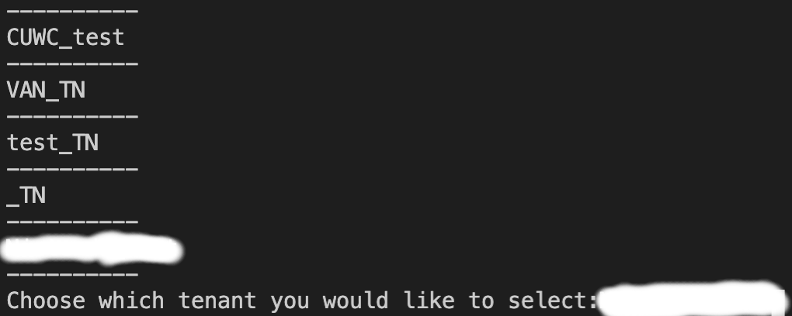

# ansible_acitoolkit_sample_code
Code that offers a workflow on adding physical domains to existing EPGs then binding that EPG to an existing Virtual Port Channel


| :exclamation:  External repository notice   |
|:---------------------------|
| This repository is now mirrored at "PLEASE UPDATE HERE - add External repo URL after code review is completed"  Please inform a https://github.com/gve-sw/ organization admin of any changes to mirror them to the external repo |
## Contacts
* Jorge Banegas

## Solution Components
* ACI
* Ansible
* ACI Toolkit Python Library

# Notes
- There is an ansible folder where it contains the playbooks and also variable files where you may tweak the ansible playbook configurations (make sure to check out the resource links below for more info on ACI with Ansible).

## Installation/Configuration

First you must edit credentials.py to include your personal ACI fabric information. Change the following lines 

```python
url = "http://x.x.x.x"
ip_address = "x.x.x.x"
username="admin"
password="password"

```

Create virtual environment and install dependencies using requirements.txt file
```sh
virtualenv env
source env/bin/activate
pip3 install -r requirements.txt
```  
## Usage

To launch script run:


    $ python3 main.py


# Screenshots
Here is an EPG that contains no Physical Domain


Step1: Script will list out all tenants and have the user to choose which one to select




Step2: Script will display all the existing EPG and their associated Application Profile and ask the user which EPG to select


Step3: Script will display all physical domains and ask the user to choose which one to apply


Step4: Script will add the physical domain selected onto the respective EPG


Step4: Script will list all VPCs of the fabric and ask the user to choose which on to apply


Step5: VPC will be attached to the EPG and the script will end


### API Reference/Documentation:
* [ACI Toolkit Documentation] (https://acitoolkit.readthedocs.io/en/latest/)
* [Ansible ACI Documentation] (https://docs.ansible.com/ansible/latest/scenario_guides/guide_aci.html)
* [Ansible ACI DOMAINtoEPG Documentation] (https://docs.ansible.com/ansible/latest/modules/aci_epg_to_domain_module.html)
* [Ansible ACI EPGtoVPC Documentation] ] (https://docs.ansible.com/ansible/latest/modules/aci_static_binding_to_epg_module.html)


### LICENSE

Provided under Cisco Sample Code License, for details see [LICENSE](LICENSE.md)

### CODE_OF_CONDUCT

Our code of conduct is available [here](CODE_OF_CONDUCT.md)

### CONTRIBUTING

See our contributing guidelines [here](CONTRIBUTING.md)

#### DISCLAIMER:
<b>Please note:</b> This script is meant for demo purposes only. All tools/ scripts in this repo are released for use "AS IS" without any warranties of any kind, including, but not limited to their installation, use, or performance. Any use of these scripts and tools is at your own risk. There is no guarantee that they have been through thorough testing in a comparable environment and we are not responsible for any damage or data loss incurred with their use.
You are responsible for reviewing and testing any scripts you run thoroughly before use in any non-testing environment.
